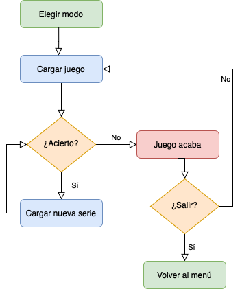
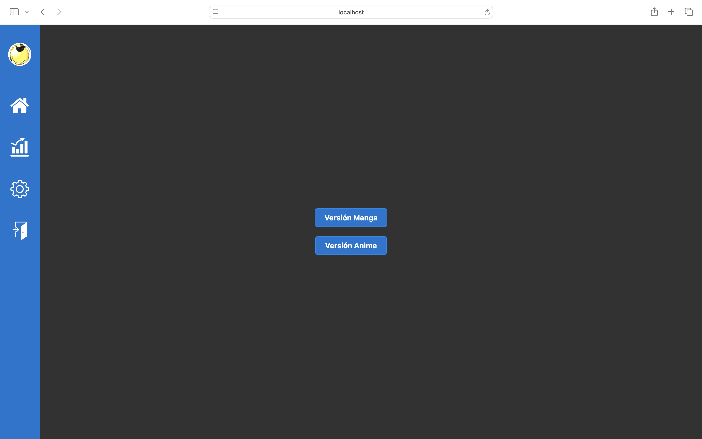
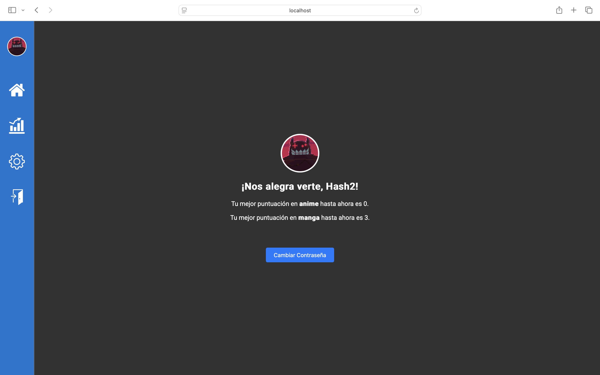
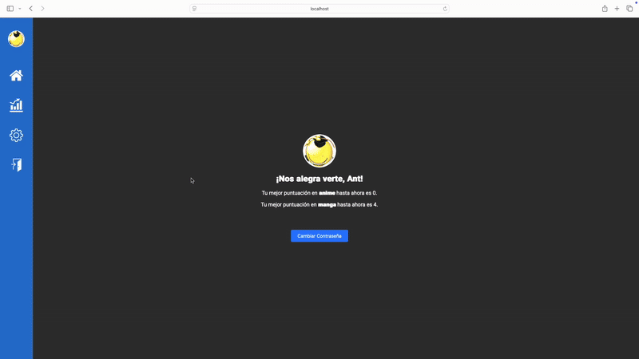
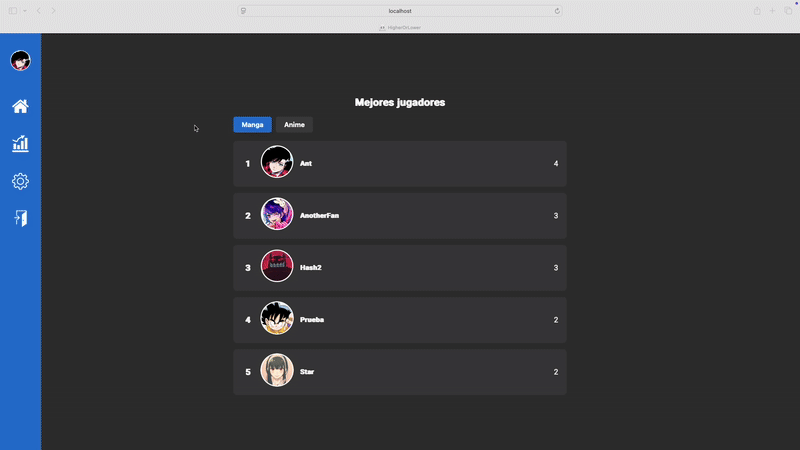

# Higher or Lower

Bienvenido a *Higher or Lower*, una aplicación web construida con Angular, Express y MongoDB. El proyecto se ejecuta utilizando Docker para facilitar el despliegue y la gestión de los servicios. El principal objetivo del juego es adivinar qué serie de anime o manga tiene mayor puntuación.

## Tecnologías Utilizadas
- **Frontend:** Angular
- **Backend:** Express.js
- **Base de Datos:** MongoDB
- **Contenedores:** Docker y Docker Compose

## Requisitos

- [Docker](https://www.docker.com)

## Instrucciones

1. Clona el repositorio: 
```bash
git clone https://github.com/aom387ISO/higherOrLower.git
```

2. Navega al directorio raíz de la aplicación:
```bash
cd higherOrLower
```

3. Ejecuta la aplicación con Docker:
```bash
docker-compose up --build
```
## Patrón de Diseño

El juego sigue el patrón *Game Loop*, un ciclo continuo donde se actualiza el estado del juego y se procesa la lógica principal. A continuación, se muestra el flujo de ejecución:

<div align="center">
  
</div>                    

## Funcionalidades principales

- **Iniciar sesión y registrarse**


- **Elección de modalidad**


- **Juego en funcionamiento**


- **Página de ajustes**


- **Con cambio de foto de perfil**


- **Tabla de clasificación con los 5 mejores jugadores en cada modo**
